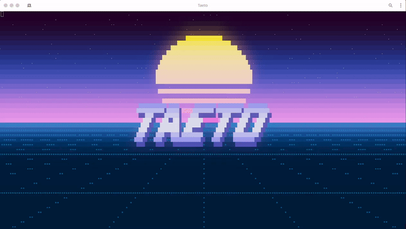

<a name="readme-top"></a>

<!-- PROJECT LOGO -->
<br />
<div align="center">
  <a href="https://github.com/othneildrew/Best-README-Template">
    
  </a>

  <p align="center">
    An engine for running animations in the terminal.
    <br />
    <a href="https://github.com/othneildrew/Best-README-Template"><strong>Explore the docs »</strong></a>
    <br />
    <br />
    <a href="https://github.com/othneildrew/Best-README-Template">View Demo</a>
    ·
    <a href="https://github.com/othneildrew/Best-README-Template/issues">Report Bug</a>
    ·
    <a href="https://github.com/othneildrew/Best-README-Template/issues">Request Feature</a>
  </p>
</div>


<!-- TABLE OF CONTENTS -->
<details>
  <summary>Table of Contents</summary>
  <ol>
    <li>
      <a href="#about-the-project">About The Project</a>
      <ul>
        <li><a href="#built-with">Built With</a></li>
      </ul>
    </li>
    <li>
      <a href="#getting-started">Getting Started</a>
      <ul>
        <li><a href="#prerequisites">Prerequisites</a></li>
        <li><a href="#installation">Installation</a></li>
      </ul>
    </li>
    <li><a href="#usage">Usage</a></li>
    <li><a href="#roadmap">Roadmap</a></li>
    <li><a href="#contributing">Contributing</a></li>
    <li><a href="#license">License</a></li>
    <li><a href="#contact">Contact</a></li>
    <li><a href="#acknowledgments">Acknowledgments</a></li>
  </ol>
</details>


<!-- ABOUT THE PROJECT -->
## About The Project



TAETO is a personal project to create a game and animation engine to run in a terminal. It's still very much in the prototype phase and will likely change significantly in the future.

<p align="right">(<a href="#readme-top">back to top</a>)</p>

<!-- GETTING STARTED -->
## Building

1. Clone repository
   ```sh
   git clone https://gitlab.com/jtkick/taeto.git
   cd taeto
   ```

2. Pull all prerequisites.
   ```sh
   git submodule update --init --recursive
   ```

3. Compile project.
   ```sh
   mkdir build && cd build
   cmake ..
   make -j$(nproc)


<!-- USAGE EXAMPLES -->
## Usage

The project comes with a couple of demo scenes that can be run using the '-t' flag. To run the demo shown at the top of this readme, run the following in the build directory.

```sh
./taeto -t demo
```

<p align="right">(<a href="#readme-top">back to top</a>)</p>


<!-- ROADMAP -->
## Roadmap

- [x] Basic rendering
- [x] Dynamic lighting
- [X] Normal mapping
- [ ] Specularity
- [X] HDR
- [X] Bloom
- [X] Shaders

See the [open issues](https://gitlab.com/jtkick/taeto/-/issues) for a full list of proposed features (and known issues).

<p align="right">(<a href="#readme-top">back to top</a>)</p>


<!-- CONTRIBUTING -->
## Contributing

Contributions are always welcome. To contribute do the following.

1. Fork the Project
2. Create your Feature Branch (`git checkout -b feature/new_feature`)
3. Commit your Changes (`git commit -m 'Add some new feature.'`)
4. Push to the Branch (`git push origin feature/new_feature`)
5. Open a Pull Request

<p align="right">(<a href="#readme-top">back to top</a>)</p>


<!-- LICENSE -->
## License

Distributed under the MIT License. See `LICENSE.txt` for more information.

<p align="right">(<a href="#readme-top">back to top</a>)</p>


<!-- CONTACT -->
## Contact

Jared Kick - jaredkick@gmail.com

Project Link: [https://gitlab.com/jtkick/taeto](https://gitlab.com/jtkick/taeto)

<p align="right">(<a href="#readme-top">back to top</a>)</p>
